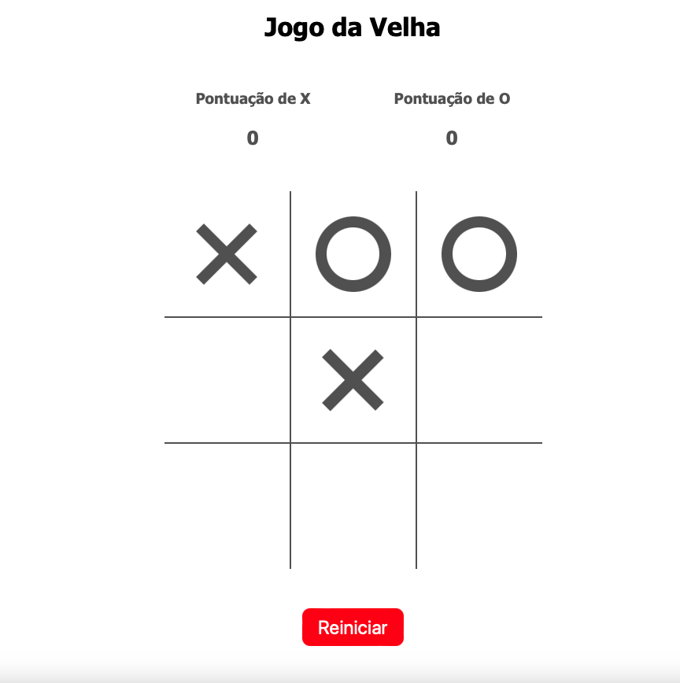

# Jogo da Velha

Este é um projeto de jogo da velha desenvolvido como parte de um trabalho prático da disciplina Programação Web I do Curso Técnico Superior Profissional em Desenvolvimento Web e Multimédia em regime Pós Laboral no Instituto Politécnico do Cavado e do Ave - IPCA, durante o ano letivo 2021/2022.

## Descrição do Projeto

Este projeto consiste em um jogo da velha implementado em HTML, CSS e JavaScript. O jogo inclui as seguintes funcionalidades:

- Dois jogadores, X e O, alternando turnos.
- Um tabuleiro interativo onde os jogadores podem clicar para fazer suas jogadas.
- Verificação de vitória ou empate.
- Pontuação para acompanhar o número de vitórias de X e O.
- A capacidade de reiniciar o jogo.

## Lógica do Jogo

O jogo segue uma lógica simples:

1. Iniciar o jogo, definindo a vez do jogador (X começa).
2. Quando um jogador clica em uma célula vazia no tabuleiro, sua marca (X ou O) é colocada na célula.
3. O jogo verifica se há um vencedor ou um empate após cada jogada.
4. A pontuação é atualizada de acordo com o resultado.
5. O jogo pode ser reiniciado a qualquer momento.

## Funções Importantes

As funções importantes podem ser encontradas no arquivo `main.js`. Aqui está uma breve descrição de cada uma delas:

- `iniciarJogo()`: Esta função inicia o jogo, define a vez do jogador, configura os eventos de clique nas células do tabuleiro e inicializa a pontuação.

- `lidarComClique(e)`: Esta função lida com o clique do jogador em uma célula do tabuleiro, coloca a marca na célula e verifica se houve uma vitória ou empate. Ela é chamada quando o jogador clica em uma célula.

- `verificarVitoria(classeAtual)`: Esta função verifica se a classe atual (X ou O) ganhou o jogo com base nas combinações de vitória. Ela retorna verdadeiro se houver uma vitória.

- `finalizarJogo(empate)`: Esta função finaliza o jogo, exibindo uma mensagem de empate ou vitória, atualizando a pontuação e permitindo que o jogador jogue novamente. Ela é chamada após o término do jogo.

## Arquivos do Projeto

- `index.html`: Este arquivo contém a estrutura HTML do jogo, incluindo o tabuleiro, botões e elementos de interface.

- `style.css`: O arquivo CSS que controla o estilo e a aparência do jogo, incluindo o design do tabuleiro e as animações.

- `main.js`: O arquivo JavaScript que contém a lógica do jogo, incluindo a implementação das funções mencionadas.

## Instruções de Uso

1. Abra o arquivo HTML (`index.html`) em seu navegador da web.
2. O jogo começa com a marca X. Clique em uma célula vazia no tabuleiro para fazer sua jogada.
3. O jogo acompanhará automaticamente as pontuações e mostrará quem venceu.
4. Você pode reiniciar o jogo a qualquer momento clicando no botão "Reiniciar".

## Créditos

Este projeto foi desenvolvido por Richard Nicholas Wagner como parte do trabalho prático da disciplina Programação Web I no IPCA.

**Nota:** Este README fornece informações detalhadas sobre a lógica do jogo, as funções implementadas e os arquivos do projeto. Para obter mais detalhes sobre a implementação, consulte os arquivos HTML, CSS e JavaScript no projeto.
